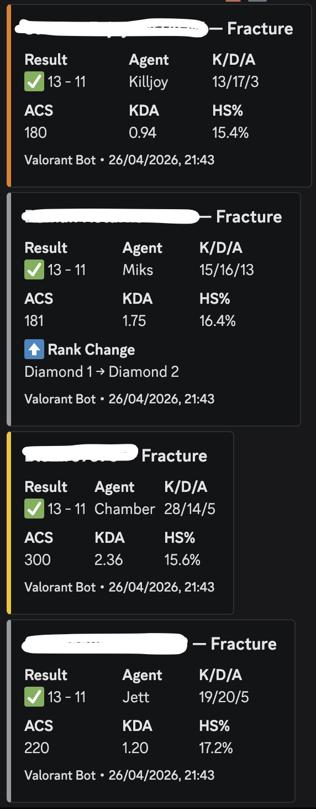
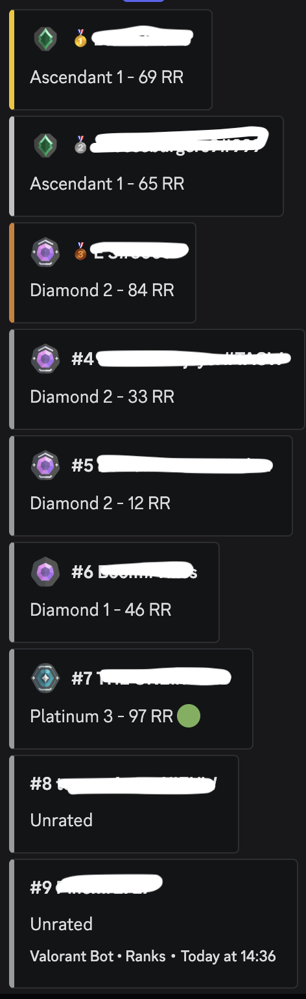

<p align="center">
  
</p>

# Valorant Discord Bot

A .NET 9 Discord bot that tracks Valorant match stats for configured players and generates banter/roast messages using Claude AI.

## How It Works

1. The bot polls tracked players for new competitive matches every 20 minutes (configurable)
2. When a new match is found, it analyzes performance (KDA, ACS, HS%) and assigns a rating from Terrible to Excellent
3. It pulls highlights out of the rounds and kills (first deaths, clutches, aces, eco rifles, AFK rounds, thrown leads and more) and counts behavior signals for every player in the lobby
4. Match results and signals are persisted locally (last 20 per player) to build player history, auto traits and squad traits
5. If 2+ tracked players were in the same party, a squad message is generated that assigns roles (scapegoat, carry, ghost, footnote) and roasts the group
6. Claude Sonnet 5.5 picks the story, tone and form from the prepared material and writes the message; recently used stories, tones, forms and openers are tracked so messages don't repeat
7. The message and a color-coded stats embed are posted to a configured Discord channel

Players can also trigger a check on-demand using the `/latest-match <name> <tag>` slash command.

## Examples

### AI-generated squad roast

When two or more tracked players queue together, Claude generates a single message that compares the group. Sample output:

> _sets down coffee, opens the manila folder, pinches the bridge of nose_
>
> Alright, let's talk about Fracture. 📋😤
>
> Player1 dropped 28 kills and 300 ACS on Chamber, genuinely the only reason this scoreboard doesn't look like a crime scene, while Player2 apparently used his Killjoy turret as a personal babysitter, going 13/17 with 180 ACS and almost certainly spending the back half of the match typing "WHY IS NOBODY WAITING FOR MY UTIL" into team chat while his own Killjoy lockdown got walked through by a running Sage. 💀🤖 Brother, your KDA sits at 0.94, you died more than you contributed, on a sentinel, on a map designed for sentinel anchoring, which is a genuinely special kind of failure.
>
> Player3 queued on Jett, the dash-in-get-a-kill agent, went 19/20 and somehow managed to die more than he killed while Player1 was busy running laps around everyone on 72 more ACS, so maybe park the "I'm better than everyone" energy until you're not posting a below-average ACS on the game's premiere entry duelist. 🔪📉 And Player4 crawled to Diamond 2, congrats on the promotion, genuinely, but 15/16 with a 16.4% headshot rate on a Vandal while saying absolutely nothing on comms until the round was already cooked is a hell of a way to celebrate a rank up. 🥂🪦
>
> Four people queued together on Fracture, won by two rounds, and three of them finished below their own historical averages. Player1 carried this squad the same way a forklift carries furniture: completely, without thanks, and clearly resenting every second of it. 🏆🗑️

### Match embed

Each player gets a color-coded stats card with agent, score, KDA, ACS, and HS%. A rank-change card is appended on promotion or demotion.

<p align="center">
  
</p>

### Ranks leaderboard

`/ranks` posts a sorted leaderboard for all tracked players, with medals on the top three and movement indicators next to RR.

<p align="center">
  
</p>

## Features

- **Competitive-only filtering** - only tracks competitive matches, skipping unranked/custom games
- **Squad detection** - detects when 2+ tracked players queue together (grouped by party) and generates one group roast with a role per player
- **Match highlights** - per-player stories from the round and kill data: first deaths and first bloods, multikills and aces, clutches, knife kills, eco rifle buys, zero-damage rounds, AFK and spawn rounds, team damage, thrown leads, comebacks, overtime, server bottom/top frag and RR penalties
- **Varied roasts** - the material for each message is gathered in code (true stories ranked by severity, tone ideas, form menu, length limits, banned openers) and the model picks story, tone and form itself; what was used is recorded in `roast_plans.json` and shown back as "recently used" so the next message goes somewhere else
- **Performance ratings** - point-based system across KDA, ACS, and HS% producing five tiers: Terrible, Bad, Average, Good, Excellent
- **AI-powered roasts** - Claude Sonnet 5.5 (`claude-sonnet-5-5`) writes the message from the prepared material; falls back to static templates if the API is unavailable
- **Player profiles** - persistent per-player bios and manual traits that give the AI personal context; bio, manual traits and auto traits share one pool, and each item has a 3-day cooldown
- **Auto traits** - derived from behavior, not just averages. Each match stores counters for every player (last alive, trades on teammates who died nearby, isolated deaths, first deaths, exit saves, utility use, plants, eco rifles) plus the lobby baseline. A trait such as "baiter" or "lurker who dies alone" enters when the player beats the lobby in 3 of their last 5 judgeable matches (8 for rare events like clutches) and is dropped again at 1 hit or fewer, so traits follow how someone plays right now. Every auto trait carries the numbers behind it, which the AI can quote. Agent, streak, map, rank and ACS traits are derived as well
- **Squad traits** - traits about how tracked players treat each other, judged against how the same player treats randoms in the same matches: "leaves X to die", "X's bodyguard", "steals X's kills", "carries X", "dies together with X", cursed or lucky duos, "always the first to die in the stack", "the reason the stack eats an RR penalty" and more. Only used in squad roasts where every named player is in the stack
- **Norwegian roasts** - `/toggle-language` switches the AI messages between English and Norwegian; embeds and command replies stay English
- **Rank change detection** - detects promotions and demotions between matches, generates dedicated AI messages for tier changes (e.g. Silver to Gold)
- **Name changes** - players are keyed by Riot puuid, so name or tag changes are picked up automatically and legacy name#tag data is migrated on startup
- **Duplicate prevention** - tracks the last seen match ID per player in `data/last_matches.json` to avoid re-posting
- **Restart cooldown** - persists last poll timestamp to disk, so the bot waits out the remaining interval on restart instead of polling immediately
- **Retry logic** - HenrikDev API calls retry up to 3 times with 2-second backoff on failure
- **Rate limiting** - 10-second delay between player API requests, 2-second delay between individual API calls

## Slash Commands

Commands marked admin only are limited to the Discord user IDs in `BotAdmin.AllowedUserIds`.

| Command                                         | Description                                                                                                                                        |
| ----------------------------------------------- | -------------------------------------------------------------------------------------------------------------------------------------------------- |
| `/latest-match <name> <tag>`                    | On-demand lookup of the latest competitive match for any player. Returns an AI-generated message and a stats embed.                                |
| `/status`                                       | Bot dashboard showing uptime, polling interval, last/next poll times, and per-player stats (last match, history summary, agents played, streaks).  |
| `/ranks`                                        | Ranked leaderboard for all tracked players, sorted by tier and RR. Shows promotion/demotion indicators.                                            |
| `/summary <name> <tag> [count]`                 | Summary of a player's stored recent matches (default 12, max 20).                                                                                  |
| `/typical <name> <tag>`                         | What is typical for a player right now: auto traits and squad traits with the numbers behind them. Open to everyone, reply visible only to you.     |
| `/profile <name> <tag>`                         | View a player's roast profile (bio, manual traits, auto traits). Access can be toggled by admins.                                                  |
| `/track <name> <tag> [region]`                  | Add a player to the tracked list (admin only). Persisted to `data/tracked_players.json`.                                                           |
| `/untrack <name> <tag>`                         | Remove a player from the tracked list (admin only).                                                                                                |
| `/tracked-players`                              | List all tracked players with their puuid, region and details (admin only).                                                                        |
| `/repair-player <puuid> <name> <tag>`           | Manually set the name and tag of a tracked player by puuid, for entries the API could not resolve (admin only).                                    |
| `/set-bio <name> <tag> <bio>`                   | Set a free-text roast bio for a player (admin only). Used by the AI to personalize messages.                                                       |
| `/add-trait <name> <tag> <trait>`               | Add a manual roast trait to a player (admin only). e.g. "always blames teammates".                                                                 |
| `/remove-trait <name> <tag>`                    | Remove one or more manual traits from a player via a select menu (admin only). Auto traits are not affected.                                      |
| `/clear-profile <name> <tag>`                   | Clear a player's bio and manual traits after confirmation (admin only). Auto traits are kept.                                                     |
| `/toggle-profile`                               | Toggle whether non-admins can use `/profile` (admin only). Defaults to enabled.                                                                    |
| `/toggle-language <English\|Norsk>`             | Set the language of the AI messages (admin only). Embeds, fallbacks and command replies stay English.                                              |

## Prerequisites

- [.NET 9 SDK](https://dotnet.microsoft.com/download/dotnet/9.0) (for local development)
- [Docker](https://www.docker.com/products/docker-desktop/) (for containerized deployment)
- A [Discord bot token](https://discord.com/developers/applications)
- A [HenrikDev API key](https://api.henrikdev.xyz)
- An [Anthropic API key](https://console.anthropic.com)

## Configuration

Copy the example config and fill in your values:

```bash
cp ValorantBot/appsettings.example.json ValorantBot/appsettings.json
```

| Key                           | Description                                                                                                                 |
| ----------------------------- | --------------------------------------------------------------------------------------------------------------------------- |
| `DiscordBot.Token`            | Discord bot token                                                                                                           |
| `DiscordBot.ChannelId`        | Discord channel ID for posting messages                                                                                     |
| `DiscordBot.GuildId`          | Discord server (guild) ID                                                                                                   |
| `HenrikDevValorantApi.ApiKey` | HenrikDev API key                                                                                                           |
| `Anthropic.ApiKey`            | Anthropic API key                                                                                                           |
| `Polling.IntervalSeconds`     | Polling interval in seconds (default: 1200)                                                                                 |
| `BotAdmin.AllowedUserIds`     | Array of Discord user IDs allowed to use admin commands                                                                     |
| `HenrikDevValorantApi.BaseUrl` | HenrikDev base URL (default in the example: `https://api.henrikdev.xyz/valorant`)                                          |

Environment variables:

| Variable   | Description                                                                                          |
| ---------- | ---------------------------------------------------------------------------------------------------- |
| `DATA_DIR` | Directory for the JSON state files. Defaults to `data/` next to the binary (`/app/data` in Docker).  |

Set the `ValorantBot` log level to `Debug` (for example in `appsettings.Development.json`) to log raw API responses, highlights and the roast choices the model made.

## Data Persistence

The bot stores state in `DATA_DIR` (default `data/`, created automatically):

| File                          | Purpose                                                                                                         |
| ----------------------------- | --------------------------------------------------------------------------------------------------------------- |
| `tracked_players.json`        | Tracked players list, managed via `/track` and `/untrack` commands                                              |
| `last_matches.json`           | Last seen match ID per player, used to prevent duplicate messages                                               |
| `match_history.json`          | Last 20 match records per player, including behavior signals, lobby baseline and per-teammate pair signals      |
| `player_profiles.json`        | Per-player bios, manual traits, auto traits, squad traits, plus the `/toggle-profile` and language settings     |
| `roast_plans.json`            | Stories, tones, forms, openers and traits used in recent roasts, used to rotate material and enforce cooldowns  |
| `message_history.json`        | Log of recent AI-generated messages                                                                             |
| `poll_state.json`             | Timestamp of last poll, used to skip polling on restart if interval has not elapsed                             |

## Running Locally

```bash
dotnet build
dotnet run --project ValorantBot
```

## Tests

```bash
dotnet test
```

`ValorantBot.Tests` covers behavior signal counting, auto trait and squad trait derivation (including when traits enter and fade), and loading older profile files.

## Running with Docker

```bash
docker compose up -d
```

To rebuild after code changes:

```bash
docker compose up -d --build
```

View logs:

```bash
docker logs -f valorant-bot
```

## Deploying to Fly.io

The project includes a `fly.toml` configured for Fly.io deployment. Every push to `main` (except Markdown-only changes) deploys automatically through the `Fly Deploy` GitHub Actions workflow. To deploy by hand:

```bash
fly deploy
```

Set secrets for API keys and configuration:

```bash
fly secrets set DiscordBot__Token="..."
fly secrets set DiscordBot__ChannelId="..."
fly secrets set DiscordBot__GuildId="..."
fly secrets set HenrikDevValorantApi__ApiKey="..."
fly secrets set Anthropic__ApiKey="..."
fly secrets set Polling__IntervalSeconds=1200
fly secrets set BotAdmin__AllowedUserIds__0=123456789012345678
```

Data is persisted via a Fly volume mounted at `/data`, so `DATA_DIR` must point there (`fly secrets set DATA_DIR=/data`). Create the volume before the first deploy:

```bash
fly volumes create bot_data --region lhr --size 1
```
